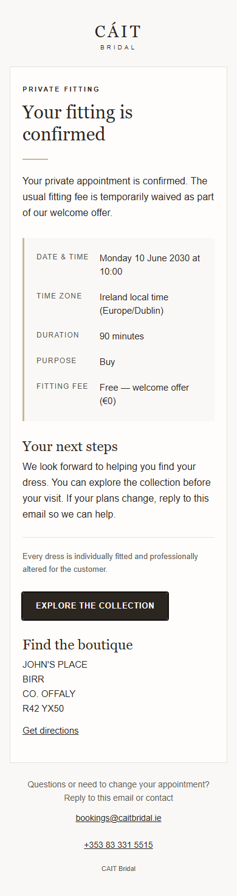
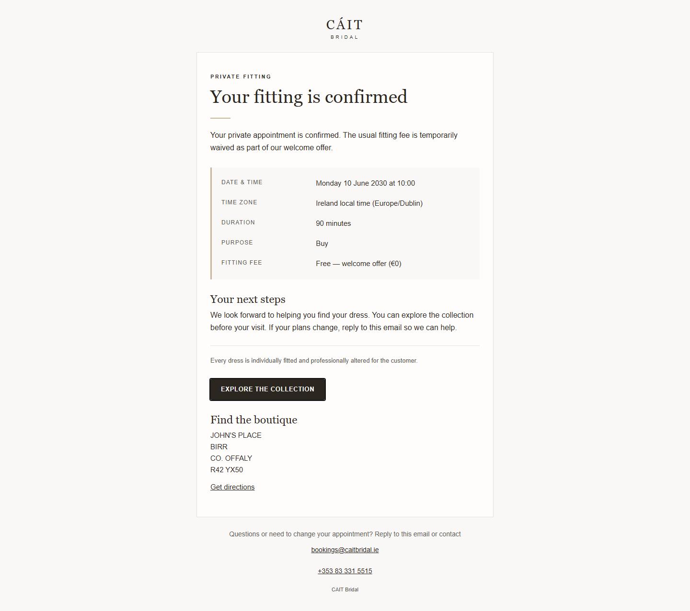
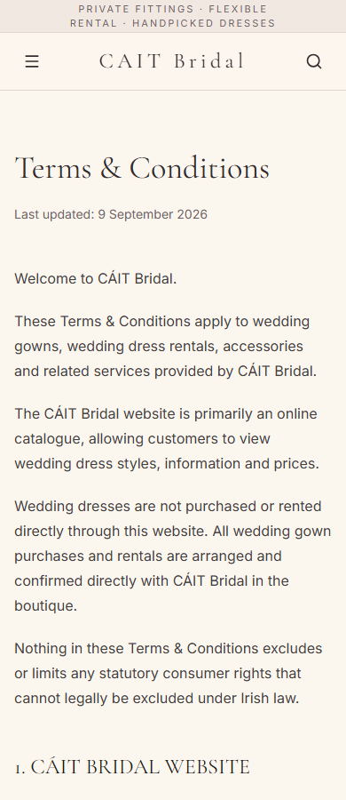
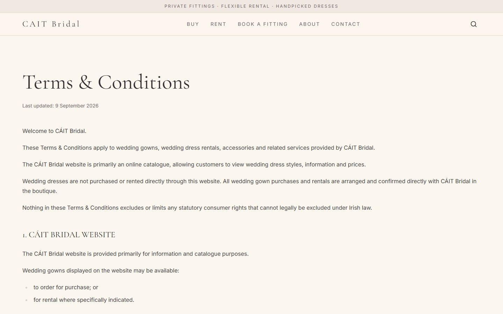
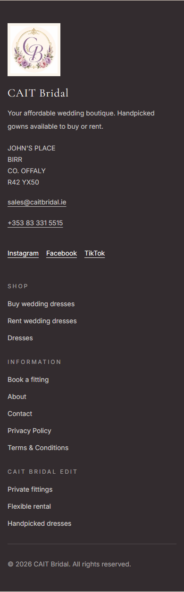
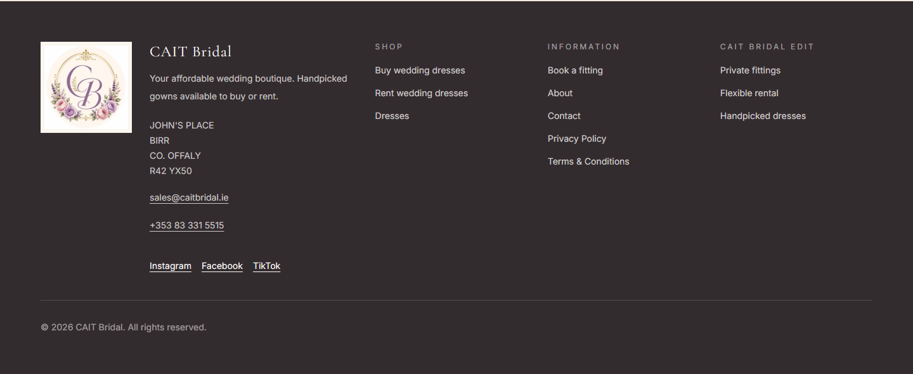

# Клієнтські листи, Terms & Conditions і футер

## Проблема та межі

Клієнтські листи показували технічний reference code й не містили адреси та тривалості примірки. Погоджені Terms ще не були опубліковані, а контакти футера невдало переносилися на мобільному.

Користувач явно погодив один PR для цих змін і мінімальне accessibility-виправлення AnnouncementBar. Міграцію графіка вже включено в master через PR #54; цей PR її не повторює. Кешування каталогу й інші незавершені задачі не включено.

## Реалізація

- Спільне формування HTML/plain text для всіх клієнтських подій; прибрано окреме поле Reference, збережено приватні URL.
- Читабельний адаптивний лист: дата, Ireland local time, фактична тривалість запису, purpose, fitting fee, наступні кроки, адреса, маршрут і контакти.
- Welcome offer показує €0; paid — лише за збереженим paymentStatus. Сума refund береться з запису в центах. Скасування не обіцяє повернення коштів.
- Terms містять 27 наданих розділів із погодженими уточненнями: alterations включені; сума застави визначається для конкретної сукні, без нового універсального €200.
- Новий Server Component /terms-and-conditions, canonical, sitemap і посилання у футері.
- Адреса/телефон/email футера розміщені вертикально; мобільний логотип не стискає контакти.
- AnnouncementBar отримав іменований region без візуальної зміни.

## Файли

- src/lib/notifications/appointmentEmailTemplates.ts
- src/components/boutique/boutique-footer.tsx
- src/components/boutique/announcement-bar.tsx
- src/content/terms-and-conditions.ts
- src/app/(frontend)/terms-and-conditions/page.tsx
- src/app/(frontend)/(sitemaps)/pages-sitemap.xml/route.ts
- tests/int/appointment-email-templates.int.spec.ts
- tests/int/appointment-email-worker.int.spec.ts
- tests/int/terms-and-conditions.int.spec.tsx
- tests/int/local-business-json-ld.int.spec.tsx
- tests/int/dresses-sitemap.int.spec.ts
- Цей звіт і скріншоти перевірки.

## Міграція та rollback

Міграція даних і новий migration gate не потрібні. Колекції, черга, SMTP, Stripe та налаштування запису не змінені.
Rollback: revert цього PR і redeploy. Уже надіслані листи не можна відкликати; заради rollback не перевідправляти їх і не скидати delivery state.

## Перевірки

- npm ci; generate:types; generate:importmap; generated-file diff — без змістових змін.
- Повний test:int послідовно: 558 тестів, 74 файли, успішно.
- lint: без помилок; наявне попередження unused dirname у Media.ts.
- TypeScript і production build перевірено.
- Нові тести: всі клієнтські події, відсутність видимого reference, приватні URL, 60/90 хвилин, Dublin summer/winter і DST, welcome/paid/refund, HTML escaping; Terms, footer, sitemap, announcement landmark.
- Візуальні та axe-перевірки: синтетичні листи 320/390/1440 px. Реальні email не надсилалися.
- Terms/footer: 320/390/1440 px, повносторінковий axe без порушень, keyboard navigation, відсутність горизонтального переповнення. HTTP 200, canonical, відсутність noindex і sitemap XML перевірено на фінальному локальному production build.

## Скріншоти

| | Mobile | Desktop |
| --- | --- | --- |
| Лист (синтетичний) |  |  |
| Terms |  |  |
| Футер |  |  |

## Ручна перевірка перед merge

1. Відкрити Preview /terms-and-conditions на mobile/desktop; перевірити 27 розділів, included alterations, індивідуальну заставу та контактні дані.
2. Перевірити адресу футера, mailto/tel/maps, посилання Terms і клавіатурний focus.
3. Перевірити canonical без query, HTTP 200, відсутність noindex для Terms і запис у /pages-sitemap.xml.
4. Переглянути синтетичні HTML-листи на narrow/desktop: підтвердження, перенесення, скасування, refund; reference не повинен бути окремим видимим полем.
5. За окремим погодженням перевірити доставку на контрольну пошту в Gmail/Outlook, без використання записів реальних клієнтів.

## Безпека, приватність, accessibility та SEO/cache

Немає нових логів, trackers, зовнішніх зображень у листі чи customer notes/phone. HTML-значення екрануються. Приватний токен залишається тільки в необхідному URL (у plain text URL за своєю природою видимий). Admin alerts і правила доставки не змінені; retired pending notice не відновлюється.

Email має читабельні кольори, heading/landmark, presentation tables, текстовий fallback і доступні посилання. Terms використовує семантичні заголовки й списки; футер не переповнює вузький екран.

Canonical Terms стабільний. Статичний список sitemap оновлено; наявний pages-sitemap tag і Payload access control збережено. Приватні маршрути/noindex/no-store не змінені.

## Обмеження

Браузерний preview не замінює перевірку всіх email-клієнтів, зокрема Outlook і dark mode. Це публікація наданого власником документа, а не юридичний висновок. Зміни ще потребують Vercel Preview review перед merge.

Точний наступний крок: перевірка об’єднаного PR у Vercel Preview, потім окреме погодження merge.
